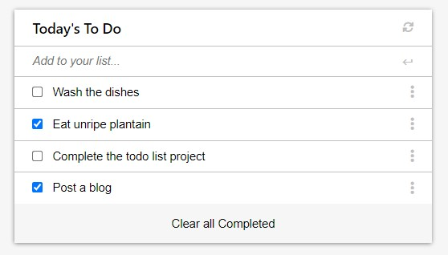

# todo-list

This project is a todo list that would allow a user manage a list of their tasks. They can conveniently create, update and delete tasks.

Here's how it looks:

<!--  -->
https://user-images.githubusercontent.com/20554583/167466539-6bf7117c-1077-4840-8d68-a01b9cb5ef78.mp4

## Built With

- HTML
- CSS
- Javascript
- Webpack

## Live Demo

[Live Demo Link](https://emmiiorji.github.io/todo-list/)

## Getting Started

To get a local copy up and running follow these simple example steps.

## Prerequisites

- A modern browser e.g [Google Chrome](https://www.google.com/chrome/)
- Have [git](https://git-scm.com/downloads) installed.
- Have the LTS version of [Node.js](https://nodejs.org/en/download/) installed.

## Setup

- git clone https://github.com/emmiiorji/todo-list.git
- cd todo-list/
- Run "npm install" to download required modules locally
- Run "npm run start" to locally host the files and view on a browser

## Deployment

- Deploy on any web server that can host a Node.js runtime environment

## Author

👤 **Emmanuel Orji-Ihuoma**

- GitHub: [@emmiiorji](https://github.com/emmiiorji)
- Twitter: [@emmiiorji](https://twitter.com/emmiiorji)
- LinkedIn: [LinkedIn](https://linkedin.com/in/emmanuel-orji-2a8317121)

## 🤝 Contributing

Contributions, issues, and feature requests are welcome!

Feel free to check the [issues page](../../issues/).

## Show your support

Give a ⭐️ if you like this project!

## Acknowledgments

- Microverse
- Coding Partners
- Code Reviewers

## 📝 License

This project is [MIT](./MIT.md) licensed.
